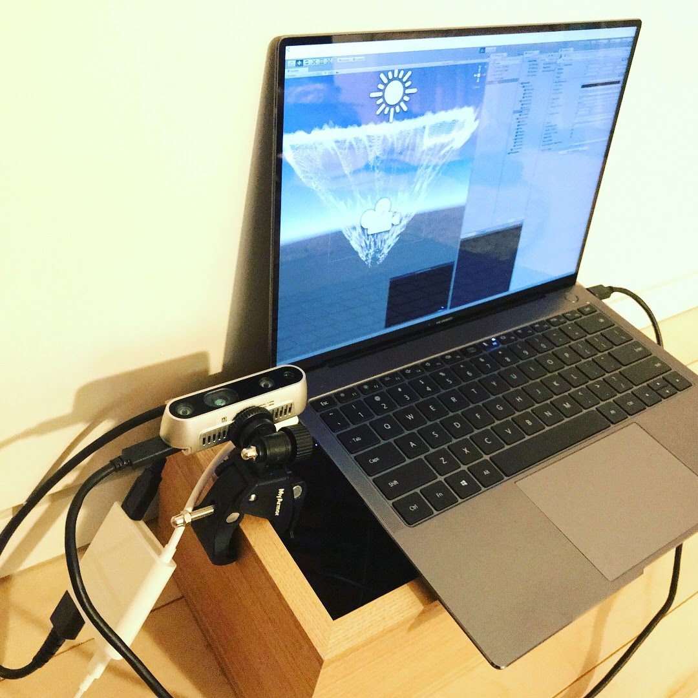

# RealSense-Touch

Touch Screen System using RealSense Depth Cammera D400 with Unity

## Related

- [RealSense](https://realsense.intel.com/)
- [librealsense](https://github.com/IntelRealSense/librealsense)
- [CCL-GPU](https://github.com/sugi-cho/CCL-GPU)
- [TouchScreen System with Kinect](https://github.com/sugi-cho/KinectStudy-Unity)
